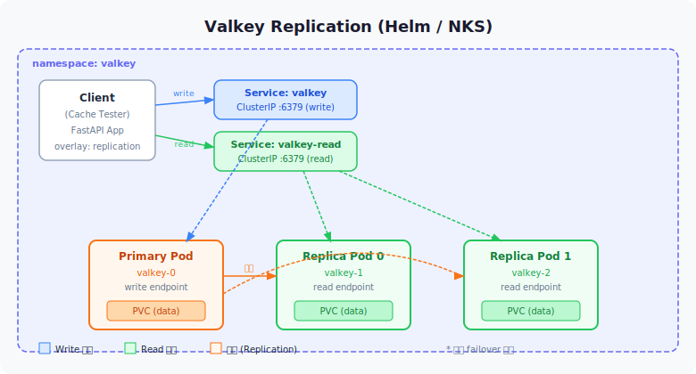
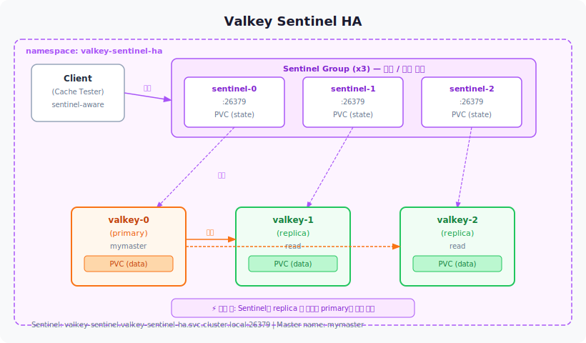
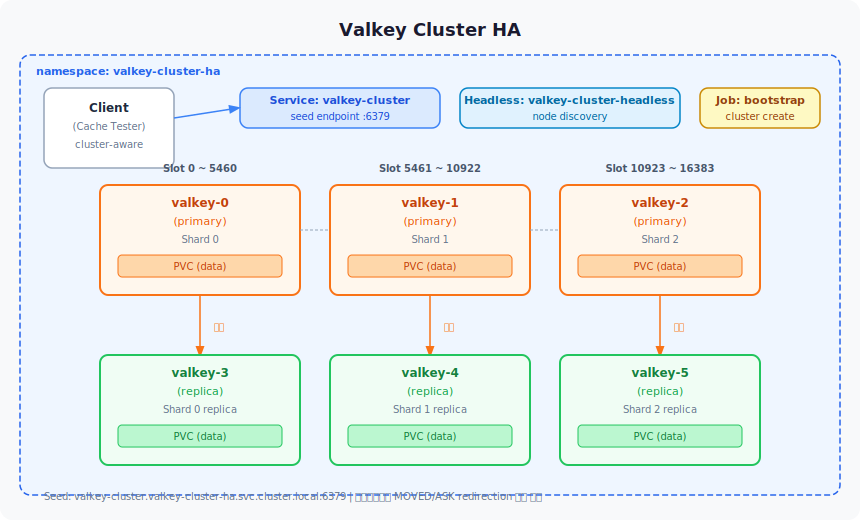

# Valkey 실험 환경 정리

이 저장소는 Valkey를 여러 아키텍처로 Kubernetes에 배포하고, FastAPI 기반 테스트 앱으로 읽기/쓰기 동작을 검증하기 위한 작업 공간입니다.

## 폴더 구조

```text
.
├─ deployments/
│  ├─ replication-helm-nks/   # NHN Cloud NKS용 Helm 기반 primary-replica 배포
│  ├─ sentinel-ha/            # Sentinel 기반 HA 배포
│  └─ cluster-ha/             # Cluster 기반 HA 배포
├─ apps/
│  └─ valkey-cache-tester/    # FastAPI 테스트 서비스 및 배포 가이드
└─ vendor/
   └─ valkey-helm/            # 참고용 공식 Helm chart 소스
```

---

## 아키텍처 다이어그램

> SVG 파일: [`docs/architecture-replication.svg`](docs/architecture-replication.svg) · [`docs/architecture-sentinel.svg`](docs/architecture-sentinel.svg) · [`docs/architecture-cluster.svg`](docs/architecture-cluster.svg)

### Replication (Helm / NKS)



```
┌─────────────────────────────────────────────────────┐
│                  namespace: valkey                  │
│                                                     │
│  ┌─────────────┐        ┌─────────────────────┐    │
│  │   Client    │──write─▶  Service: valkey     │    │
│  │ (Cache      │        │  (ClusterIP :6379)   │    │
│  │  Tester)    │──read──▶  Service: valkey-read│    │
│  └─────────────┘        └──────────┬──────────┘    │
│                                    │                │
│              ┌─────────────────────┼──────────┐    │
│              ▼                     ▼          ▼    │
│       ┌────────────┐  ┌────────────────┐  ┌──────┐ │
│       │  Primary   │  │  Replica-0     │  │Repl. │ │
│       │  Pod       │──▶  Pod           │  │ -1   │ │
│       │ (write)    │  │ (read)         │  │(read)│ │
│       │  PVC       │  │  PVC           │  │ PVC  │ │
│       └────────────┘  └────────────────┘  └──────┘ │
└─────────────────────────────────────────────────────┘
```

### Sentinel HA



```
┌──────────────────────────────────────────────────────────┐
│              namespace: valkey-sentinel-ha               │
│                                                          │
│  ┌──────────────┐    ┌──────────────────────────────┐   │
│  │    Client    │    │  Sentinel Group (x3)          │   │
│  │ (Sentinel-   │───▶│  sentinel-0 :26379            │   │
│  │  aware)      │    │  sentinel-1 :26379            │   │
│  └──────────────┘    │  sentinel-2 :26379            │   │
│                      └──────────────┬─────────────── ┘   │
│                           감시/승격  │                    │
│              ┌───────────────────────┼──────────┐        │
│              ▼                       ▼          ▼        │
│       ┌────────────┐  ┌──────────────────┐  ┌────────┐  │
│       │ valkey-0   │  │   valkey-1       │  │valkey-2│  │
│       │ (primary)  │─▶│   (replica)      │  │(repl.) │  │
│       │  PVC       │  │   PVC            │  │ PVC    │  │
│       └────────────┘  └──────────────────┘  └────────┘  │
│                                                          │
│  장애 시: Sentinel이 replica 중 하나를 primary로 자동 승격  │
└──────────────────────────────────────────────────────────┘
```

### Cluster HA



```
┌──────────────────────────────────────────────────────────────┐
│                namespace: valkey-cluster-ha                  │
│                                                              │
│  ┌──────────────┐    ┌──────────────────────────────────┐   │
│  │    Client    │    │  Service: valkey-cluster          │   │
│  │  (cluster-   │───▶│  (seed endpoint :6379)           │   │
│  │   aware)     │    └──────────────────────────────────┘   │
│  └──────────────┘    ┌──────────────────────────────────┐   │
│                      │  Headless: valkey-cluster-headless│   │
│                      └──────────────────────────────────┘   │
│                                                              │
│   Slot 0~5460      Slot 5461~10922     Slot 10923~16383      │
│  ┌──────────┐      ┌──────────┐        ┌──────────┐         │
│  │valkey-0  │      │valkey-1  │        │valkey-2  │         │
│  │(primary) │      │(primary) │        │(primary) │         │
│  │  PVC     │      │  PVC     │        │  PVC     │         │
│  └────┬─────┘      └────┬─────┘        └────┬─────┘         │
│       │ 복제             │ 복제               │ 복제           │
│  ┌────▼─────┐      ┌────▼─────┐        ┌────▼─────┐         │
│  │valkey-3  │      │valkey-4  │        │valkey-5  │         │
│  │(replica) │      │(replica) │        │(replica) │         │
│  │  PVC     │      │  PVC     │        │  PVC     │         │
│  └──────────┘      └──────────┘        └──────────┘         │
└──────────────────────────────────────────────────────────────┘
```

### Cache Tester 연결 구조

```
┌─────────────────────────────────────────────────────────────┐
│                   valkey-cache-tester                       │
│                                                             │
│  overlay: replication ──▶ standalone 모드                   │
│    VALKEY_HOST      = valkey.valkey.svc (write)             │
│    VALKEY_READ_HOST = valkey-read.valkey.svc (read)         │
│                                                             │
│  overlay: sentinel ─────▶ sentinel 모드                     │
│    VALKEY_SENTINEL_HOSTS = valkey-sentinel.valkey-sentinel-ha.svc:26379 │
│    VALKEY_MASTER_NAME    = mymaster                         │
│                                                             │
│  overlay: cluster ──────▶ cluster 모드                      │
│    VALKEY_HOST = valkey-cluster.valkey-cluster-ha.svc:6379  │
└─────────────────────────────────────────────────────────────┘
```

---

## 아키텍처 요약

### 1. Replication + Helm + NKS

위치: `deployments/replication-helm-nks`

구성:
- `1 primary + 2 replicas`
- 쓰기 서비스: `valkey`, 읽기 서비스: `valkey-read`
- 인증, replica PVC, metrics exporter 사용

특징:
- 공식 Valkey Helm chart 기반으로 관리가 단순함
- 읽기/쓰기 분리를 빠르게 테스트 가능
- 자동 failover 없음
- NKS PoC나 기본 복제 검증에 적합

배포:
```powershell
kubectl create namespace valkey
kubectl apply -f .\deployments\replication-helm-nks\nks-csi-storageclass.yaml
kubectl apply -n valkey -f .\deployments\replication-helm-nks\valkey-auth-secret.yaml

helm repo add valkey https://valkey-io.github.io/valkey-helm/
helm repo update

helm upgrade --install valkey valkey/valkey `
  --namespace valkey `
  -f .\deployments\replication-helm-nks\valkey-values-nks.yaml `
  --wait --timeout 10m
```

---

### 2. Sentinel HA

위치: `deployments/sentinel-ha`

구성:
- `3 Valkey + 3 Sentinel`
- Valkey 데이터 PVC + Sentinel 상태 PVC

동작 방식:
- 기본 구조는 primary-replica
- Sentinel이 primary를 감시하다가 장애 시 replica를 새 primary로 승격
- 클라이언트는 Sentinel에 현재 primary를 질의해서 접속

주요 엔드포인트:
- Sentinel: `valkey-sentinel.valkey-sentinel-ha.svc.cluster.local:26379`
- Valkey nodes: `valkey-nodes.valkey-sentinel-ha.svc.cluster.local`
- Master name: `mymaster`

주의:
- 클라이언트는 Sentinel-aware 여야 함
- 샤딩 없이 failover 중심 구성

배포:
```powershell
kubectl apply -k .\deployments\sentinel-ha
```

---

### 3. Cluster HA

위치: `deployments/cluster-ha`

구성:
- `6 Valkey 노드 (3 primary + 3 replica)`
- 각 노드별 PVC
- bootstrap Job으로 cluster 초기화

동작 방식:
- 슬롯 기반 샤딩
- 클러스터 자체 failover
- 클라이언트는 cluster-aware 여야 함

주요 엔드포인트:
- Cluster seed: `valkey-cluster.valkey-cluster-ha.svc.cluster.local:6379`
- Headless discovery: `valkey-cluster-headless.valkey-cluster-ha.svc.cluster.local`

주의:
- 단일 Service는 seed endpoint 용도이며 전체 라우팅 계층이 아님
- 클라이언트가 cluster redirection을 처리해야 함

배포:
```powershell
kubectl apply -k .\deployments\cluster-ha
```

---

### 4. Cache Tester

위치: `apps/valkey-cache-tester`

구성:
- FastAPI 기반 테스트 앱
- `standalone` / `sentinel` / `cluster` 연결 모드 지원
- Kustomize overlay로 각 아키텍처에 맞게 연결

제공 기능:
- 캐시 쓰기 / 읽기 / 삭제
- 샘플 데이터 seed
- write 후 read까지 확인하는 roundtrip 테스트
- readiness 및 연결 정보 확인

배포 (overlay 선택):
```powershell
# replication
kubectl apply -k .\apps\valkey-cache-tester\k8s\overlays\replication

# sentinel
kubectl apply -k .\apps\valkey-cache-tester\k8s\overlays\sentinel

# cluster
kubectl apply -k .\apps\valkey-cache-tester\k8s\overlays\cluster
```

배포 전 확인:
- `k8s/base/deployment.yaml`의 이미지를 실제 이미지로 수정
- `k8s/base/secret.yaml`의 비밀번호를 실제 Valkey 비밀번호로 수정

---

## 아키텍처 선택 기준

| 상황 | 권장 구성 |
|---|---|
| NKS에서 빠르게 PoC, 읽기/쓰기 분리 테스트 | `replication-helm-nks` |
| 자동 failover 필요, 샤딩은 불필요 | `sentinel-ha` |
| 샤딩 + HA 모두 필요 | `cluster-ha` |

---

## 시작 가이드

| 목적 | 참고 문서 |
|---|---|
| Helm 기반 NKS replication 구성 | `deployments/replication-helm-nks/README.md` |
| Sentinel 기반 HA 구성 | `deployments/sentinel-ha/README.md` |
| Cluster 기반 HA 구성 | `deployments/cluster-ha/README.md` |
| 테스트 앱 및 테스트 가이드 | `apps/valkey-cache-tester/README.md` |

테스트 가이드 파일 (PowerShell 기준):
- `apps/valkey-cache-tester/TEST-GUIDE-current-replication-powershell.md`
- `apps/valkey-cache-tester/TEST-GUIDE-sentinel-powershell.md`
- `apps/valkey-cache-tester/TEST-GUIDE-cluster-powershell.md`

---

## 참고

- `vendor/valkey-helm`은 공식 Helm chart를 참고용으로 저장한 폴더입니다.
- 실제 운영용 수정은 `deployments` 아래 배포 폴더 기준으로 보는 것이 맞습니다.
